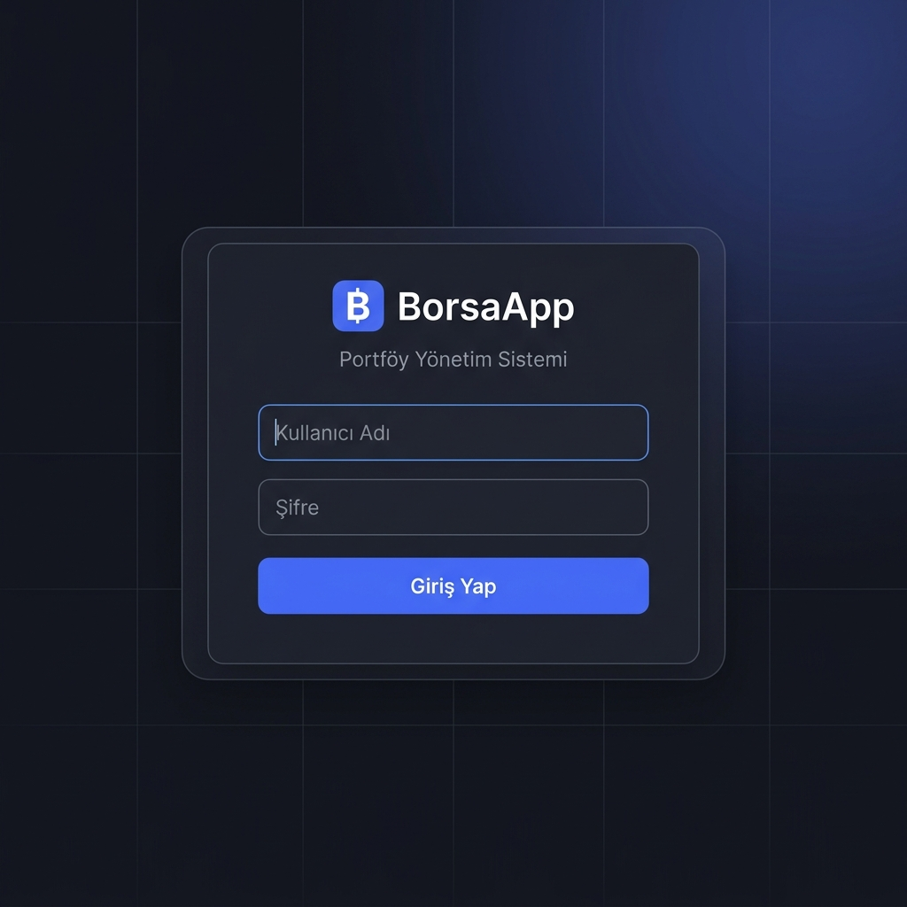
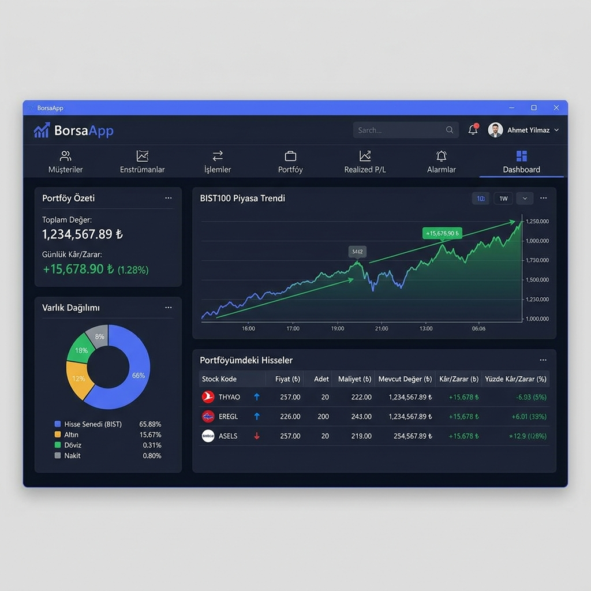
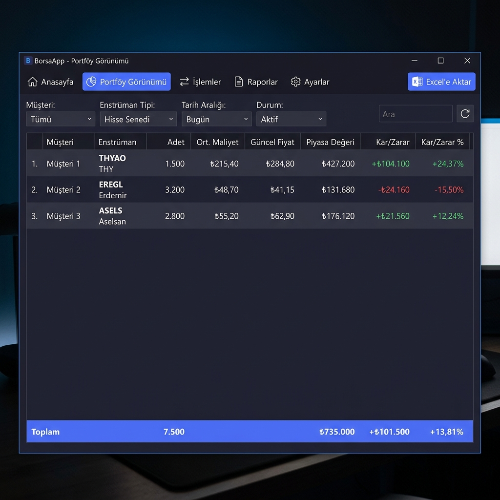

<div align="center">



# 📈 BorsaApp — Portföy Yönetim Sistemi

**BorsaApp**, Türk borsası (BIST) için geliştirilmiş, masaüstü tabanlı bir portföy yönetim uygulamasıdır.  
Çoklu müşteri yönetimi, gerçek zamanlı fiyat takibi, alım-satım işlemleri, fiyat alarmları ve detaylı raporlama özelliklerini tek bir arayüzde sunar.


</div>

---

## 🖼️ Ekran Görüntüleri

<div align="center">

| Dashboard | Portföy |
|:---------:|:-------:|
|  |  |

</div>

---

## ✨ Özellikler

| Modül | Açıklama |
|-------|----------|
| 👤 **Müşteri Yönetimi** | Müşteri ekleme, düzenleme, risk seviyesi ve nakit bakiye takibi |
| 📈 **Enstrümanlar** | BIST hisse senetleri, canlı fiyat güncelleme (web scraping) |
| 🔄 **İşlemler** | Alım-satım emirleri, iptal ve gerekçe kaydı |
| 💼 **Portföy** | Müşteri bazlı portföy görünümü, ortalama maliyet & K/Z hesabı |
| 💰 **Realized P/L** | Gerçekleşmiş kâr/zarar raporu, dönem ve müşteri filtresi |
| 🔔 **Fiyat Alarmları** | Üst/alt fiyat alarmları, otomatik satış tetikleyici |
| 📊 **Dashboard** | Özet kartlar, portföy dağılım pasta grafiği, piyasa trend grafiği |
| 🎨 **Tema** | Açık / Koyu tema geçişi |
| 📥 **Excel Export** | Portföy ve raporları `.xlsx` olarak dışa aktarma |
| 🧾 **Audit Log** | Tüm işlemlerin otomatik denetim kaydı |

---

## 🏗️ Mimari

```
BorsaApp/
├── BorsaApp.Entities/       → Domain modelleri (POCO sınıfları)
├── BorsaApp.DAL/            → Veri erişim katmanı (Dapper + SQL Server)
│   ├── Repositories/        → Repository pattern implementasyonları
│   └── DatabaseInitializer  → Otomatik DB & tablo oluşturma
├── BorsaApp.BLL/            → İş mantığı katmanı (Service sınıfları)
│   └── Services/            → AssetService, TradeService, PortfolioService...
└── BorsaApp.Wpf/            → WPF arayüz katmanı (MVVM)
    ├── Views/               → XAML ekranları (Dashboard, Portföy, vb.)
    ├── ViewModels/          → ViewModel sınıfları
    └── Themes/              → Koyu/Açık tema kaynak dosyaları
```

**Kullanılan teknolojiler:**
- 🔷 **.NET 8 + WPF** — masaüstü uygulama çerçevesi
- 🗄️ **Dapper** — micro-ORM (SQL üzerinde hızlı sorgu)
- 🗃️ **SQL Server LocalDB** — yerel veritabanı (kurulum gerektirmez)
- 📊 **LiveCharts2 / OxyPlot** — grafik bileşenleri
- 📥 **EPPlus / ClosedXML** — Excel dışa aktarma

---

## ⚙️ Kurulum

### Gereksinimler

| Gereksinim | Minimum Sürüm | Notlar |
|---|---|---|
| Windows | Windows 10 / 11 | 64-bit |
| .NET SDK | 8.0+ | [İndir](https://dotnet.microsoft.com/download/dotnet/8.0) |
| SQL Server LocalDB | 2019+ | Visual Studio ile birlikte gelir veya ayrıca kurulabilir |
| Visual Studio | 2022 (isteğe bağlı) | Geliştirme için önerilir |

### Adım 1 — Repoyu Klonlayın

```bash
git clone https://github.com/KULLANICI_ADI/BorsaApp.git
cd BorsaApp
```

### Adım 2 — LocalDB Kurulumu (eğer yoksa)

SQL Server LocalDB, Visual Studio 2022 ile birlikte otomatik olarak kurulur.  
Ayrıca kurmak için:

```bash
# Winget ile:
winget install Microsoft.SQLServerLocalDB

# Veya Microsoft sitesinden indirin:
# https://learn.microsoft.com/en-us/sql/database-engine/configure-windows/sql-server-express-localdb
```

Kurulumu doğrulayın:
```bash
sqllocaldb info
# Çıktı: MSSQLLocalDB görünmelidir
```

### Adım 3 — Bağlantı Dizesini Yapılandırın

`BorsaApp.Wpf/appsettings.json` dosyasını açın:

```json
{
  "ConnectionStrings": {
    "Default": "Server=(localdb)\\MSSQLLocalDB;Database=BorsaApp;Trusted_Connection=True;MultipleActiveResultSets=true;TrustServerCertificate=True;"
  },
  "Portfolio": {
    "CostMethod": "AvgCost"
  }
}
```

> **Not:** Varsayılan `(localdb)\MSSQLLocalDB` genellikle değiştirilmesi gerekmez.  
> Uzak bir SQL Server kullanmak istiyorsanız bağlantı dizesini güncelleyin.

### Adım 4 — Uygulamayı Çalıştırın

```bash
# Geliştirme modu
dotnet run --project BorsaApp.Wpf/BorsaApp.Wpf.csproj
```

**veya** Visual Studio'da `BorsaApp.sln` dosyasını açıp **F5** ile başlatın.

> İlk çalıştırmada `BorsaApp` veritabanı otomatik olarak oluşturulur ve tablolar seed data ile doldurulur.

### Adım 5 — Giriş Yapın

| Kullanıcı | Şifre | Rol |
|-----------|-------|-----|
| `admin` | `admin` | Yönetici (tüm işlemler) |
| `user` | `admin` | Müşteri (kısıtlı görünüm) |

---

## 📦 Dağıtım (Tek EXE)

Projeyi bağımsız, kurulum gerektirmeyen tek bir `.exe` olarak yayınlamak için:

```bash
publish.bat
```

veya manuel olarak:

```bash
cd BorsaApp.Wpf
dotnet publish -c Release -r win-x64 --self-contained true -p:PublishSingleFile=true -o ../dist
```

Çıktı `dist/BorsaApp.Wpf.exe` olarak oluşturulur. Bu dosyayı doğrudan çalıştırabilirsiniz.

---

## 📁 Veritabanı Şeması

Uygulama ilk çalıştırmada aşağıdaki tabloları otomatik oluşturur:

```sql
Customers    → Müşteri bilgileri ve nakit bakiye
Assets       → Hisse senetleri ve anlık fiyatlar
Trades       → Alım/satım işlemleri
Users        → Kullanıcı hesapları (hash'li şifre)
PriceAlarms  → Fiyat alarm tanımları
AuditLogs    → İşlem denetim kayıtları
```

---

## 🤝 Katkı

Pull request ve issue'lar memnuniyetle karşılanır.

1. Repoyu fork'layın
2. Yeni bir branch oluşturun: `git checkout -b feature/yeni-ozellik`
3. Değişikliklerinizi commit edin: `git commit -m 'feat: yeni özellik eklendi'`
4. Push edin: `git push origin feature/yeni-ozellik`
5. Pull Request açın

---

## 📄 Lisans

Bu proje [MIT Lisansı](LICENSE) altında lisanslanmıştır.

---

<div align="center">
Geliştirici: <a href="https://github.com/uaslntrk">uaslntrk</a> &nbsp;|&nbsp; 2026
</div>
